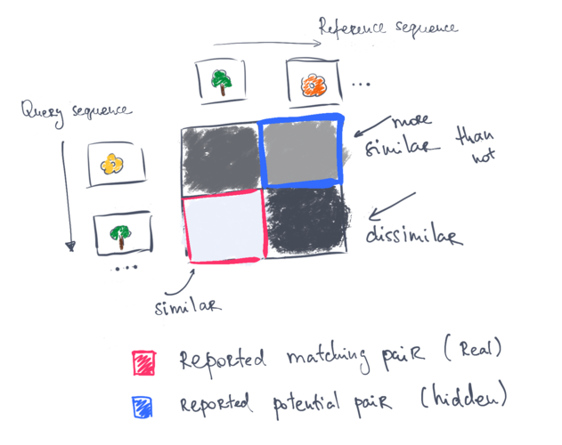

# Image Sequence Localizer


[](LICENSE.txt)

This project proposes a framework for outdoor **visual place recognition**.

It can recognize visually similar places in GPS-denied environments.
Thus, can serve as a candidate search technique in the context of full 6 DoF robot pose estimation.

Visual place recognition, also known as "weak localization", is performed here by matching sequences of images.
The assumption is then that the input is a sequence of images. The program outputs the ids of image pairs that represent the same place. The matching pairs are also visualized as concatenated images.

## Build

Prerequisites:

```
sudo apt-get install -y build-essential libopencv-dev libyaml-cpp-dev libprotobuf-dev libprotoc-dev protobuf-compiler
```

Tested on Ubuntu 20.04.

To build the code:

```
mkdir build
cd build
cmake ..
make -j4
```

To be able to use the `python` part, for example for visualization, I recommend setting up a virtual environment of your choice and installing the provided requirements through:

```
pip install -r requirements.txt
```

Requires `Python 3.8+`.

## Usage

If you have images sequences, start matching procedure by calling:

```bash
cd src/python
python run_matching_from_images.py \
    --query_images <path_to_images> \
    --reference_images <path_to_images> \
    --dataset_name <dataset_name> \
    --output_dir <path_to_folder>
    --write_image_matches
```

If you have pre-computed features already:

```bash
python run_matching_from_features.py \
    --query_features <path_to_features> \
    --reference_features <path_to_features> \
    --dataset_name <dataset_name> \
    --output_dir <path_to_folder>
```

\*\* Make sure the features are stored as a correct proto message `.Feature.pb`, check [localization_protos.proto](src/localization_protos.proto) for format details.

The framework assumes that there is a _query_ image sequence, for every image of which the user wants to find the corresponding image in the _reference_ image sequence.

The scripts store all the results in the user-provided `output_dir`. The user also needs to specify the name of the dataset, for example, "my_awesome_dataset".

For more details about the parameters, please use `python run_matching_from_*.py --help`.

For more details about the underlying method and the interpretation of the results, please have a look at [paper](http://www.ipb.uni-bonn.de/pdfs/vysotska16ral-icra.pdf).
Here is a sketch of what roughly is happening for those who don't like to read much 

## Parent project

This repository is a continuation of my previous works [vpr_relocalization](https://github.com/PRBonn/vpr_relocalization) and [online_place_recognition](https://github.com/PRBonn/online_place_recognition).

The plan is to gradually modernize and improve the code by preserving the essential capabilities of the system.

**Essential capabilities**:

1. Given two sequences of images compute the matching image pairs.
2. Scripts to visualize the results.
